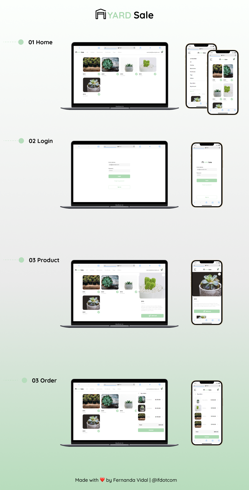

# yardSale
YardSale is a project developed in the Frontend Developer course at Platzi, showcasing the practical application of HTML, CSS, and JavaScript in the development of an e-commerce website for the sale of second-hand items.
## Table of content
- [Overview](#overview)
  - [Screenshot](#screenshot)
  - [Links](#links)
- [My process](#my-process)
- [Built with](#built-with)
-[Author](#author)
### Screenshot

### Links

- Live Site URL: [yardSale](https://ifdotcom.github.io/mars-rover-photos/html/home.html)

## My process

### Built with

- HTML
- CSS
- JavaScript

## Author

- GitHub - [ifdotcom](https://github.com/ifdotcom)
- Behance - [ifdotcom](https://www.behance.net/ifvidal)
- LinkedIn - [ifdotcom](https://www.linkedin.com/in/if-vidal/)
